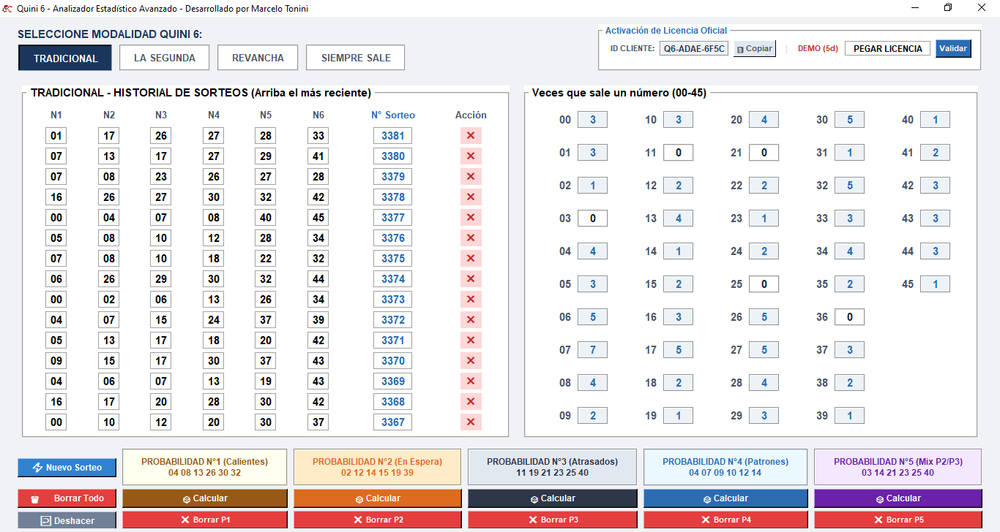

# Analizador Estadístico Avanzado - Quini 6

Software profesional diseñado para el análisis de datos, cálculo dinámico de frecuencias y estimación de patrones probabilísticos en tiempo real para el juego Quini 6 de Argentina. Ideal tanto para agencias de lotería como para apostadores particulares que buscan profesionalizar sus jugadas.

---

> 💡 **¿También jugás al Loto Plus?** Maximizá tus chances y descargá el *Analizador Avanzado de Loto Plus* desde su repositorio oficial: [👉 Ir al Analizador de Loto Plus](https://github.com/mtoni2/Loto-Plus)

---

## 📊 Vista Previa de la Interfaz

## 🚀 Características Clave
* **Cálculo de Frecuencias en Caliente:** Actualización matemática instantánea de las Bolas (00-45) conforme se interactúa con la grilla y las diferentes pestañas.
* **Persistencia Segura de Datos:** El historial de sorteos y el estado de la licencia se resguardan de forma automatizada en la carpeta local del sistema (`AppData`), garantizando que no se pierdan datos en futuras actualizaciones o reinstalaciones.
* **Predicción Avanzada:** 5 algoritmos de cálculo probabilístico independientes para armar tus jugadas estratégicas basados en el comportamiento histórico real.
* **🖥️ Compatibilidad de Sistema:** Optimizado y totalmente compatible para ejecutarse en sistemas operativos desde **Windows 7, 8, 10, 11 y versiones superiores que existan**, tanto en arquitecturas de 32 como de 64 bits.

---

## 🗺️ Cobertura de Modalidades (¿Cómo funciona el juego?)

El software está diseñado para que puedas cambiar de pestaña según la modalidad que quieras analizar. Cada una guarda su propio historial independiente de números, adaptándose a las reglas oficiales del Quini 6:

* **🔵 TRADICIONAL:** El sorteo base del juego. Podés cargar y observar las frecuencias exactas de los 6 números principales que salen en esta primera instancia.
* **🔵 SEGUNDA VUELTA:** El segundo sorteo del billete. El programa analiza este historial por separado, ya que los números que suelen salir aquí siguen sus propios patrones de frecuencia combinatoria.
* **🔵 REVANCHA:** La modalidad estrella con pozos generalmente acumulados. Al activar esta pestaña, la grilla se updates completamente con los datos históricos exclusivos del Revancha.
* **🔵 SIEMPRE SALE:** La modalidad donde siempre hay ganadores (con 6, 5 o menos aciertos). Ideal para buscar los números más recurrentes bajo esta regla específica de premiación.

---

## 🧠 ¿Cómo funcionan los 5 Algoritmos de Predicción? (P1 a P5)

Para facilitarte la jugada, el software procesa todo el historial cargado mediante 5 motores estadísticos independientes. Podés calcularlos por separado con un solo clic:

* **🔥 P1 - Probabilidad N°1 (Calientes):** Analiza la tendencia inmediata. Detecta los números que están en "racha" o mayor flujo de salida en los últimos sorteos. Ideal para seguir la inercia ganadora.
* **⏳ P2 - Probabilidad N°2 (En Espera):** Cruza la frecuencia histórica con los ciclos medios de aparición. Identifica aquellos números que están "maduros" estadísticamente y tienen una probabilidad óptima de salir.
* **📉 P3 - Probabilidad N°3 (Atrasados):** Rastrea las ausencias prolongadas. El algoritmo calcula cuáles son los números que llevan más tiempo sin aparecer en la grilla oficial para aprovechar la ley de promedio combinatorio.
* **🎯 P4 - Probabilidad N°4 (Patrones):** Analiza la composición geométrica de las combinaciones ganadoras (paridad par/impar y distribución de decenas). Genera una jugada balanceada que imita el comportamiento real del azar.
* **🔮 P5 - Probabilidad N°5 (Mix P2/P3):** El motor híbrido más avanzado. Fusiona los algoritmos de números en espera (P2) con los rezagados estructurales (P3) para ofrecerte una jugada de cobertura matemática total.

---

📦 **Base de Datos y Actualización Autónoma**

El software se entrega completamente listo para usar y con soporte a largo plazo:

* **Historial Oficial Precargado:** Incluye una base de datos calibrada con los **últimos 20 sorteos oficiales para cada una de las modalidades**, dándote el punto de partida estadístico ideal.

* **Mantenimiento Autónomo:** El programa no queda obsoleto. Gracias al botón "Nuevo Sorteo", se puede ir cargando y anexando los nuevos resultados de la Lotería a medida que se vayan sorteando de forma oficial, manteniendo los 5 motores probabilísticos siempre al día.

---

## 💾 Descargar Versión Demo (Prueba Gratuita por 7 días)
Podés descargar e instalar la versión de prueba funcional directamente desde este servidor seguro:

👉 **[DESCARGAR INSTALADOR DE LA DEMO](https://github.com/mtoni2/Quini-6/raw/main/Instalador_Quini6_Avanzado.exe)**

> ⚠️ **Nota sobre la instalación:** Al ser un software independiente y no estar firmado con un certificado comercial masivo, Windows SmartScreen podría mostrar una advertencia de "Archivo no seguro" (Falso Positivo). El instalador está 100% libre de virus. Para continuar la instalación, simplemente hacé clic en **"Más información"** y luego en **"Ejecutar de todas formas"**.

---

## 🛒 Adquirir Licencia Oficial (Versión Completa)
Para desbloquear el software de forma permanente y sin límites de tiempo, podés adquirir la Licencia Oficial.

### 💰 Precio para Argentina: $49.999 ARS *(Pago Único)*

### 📋 Instrucciones para la Activación:
1. Descargá e instalá la Demo desde el enlace de arriba.
2. Abrí el programa en tu computadora.
3. En el recuadro superior derecho (**Activación de Licencia Oficial**), vas a ver tu **ID CLIENTE** único. Hacé clic en el botón **📋 Copiar**.
4. Enviame ese código por WhatsApp junto con tu comprobante de pago para que te genere tu Licencia de activación permanente.

### 💬 Contactar por WhatsApp para Comprar:
Hacé clic en el siguiente enlace para enviar el código y coordinar el pago de forma directa:

👉 **[Enviar ID Cliente por WhatsApp](https://wa.me/5492615458021?text=Hola%20Marcelo,%20quiero%20adquirir%20la%20licencia%20del%20Analizador%20Quini%206%20por%20$49.999.%20Mi%20ID%20Cliente%20es:%20)**

---

🎨 **Muchas gracias por adquirir el Analizador Estadístico Avanzado del Quini 6**

***

> ⚖️ **Descargo de Responsabilidad (Disclaimer):** Este software es una herramienta estrictamente analítica, estadística y matemática diseñada para estudiar frecuencias de salida, históricos y tendencias probabilísticas basadas en datos reales. El Quini 6 es un juego regido por el azar. El uso de esta aplicación optimiza y profesionaliza la selección de números, pero **NO garantiza la obtención de premios ni resultados ganadores**. El desarrollador no se responsabiliza por las decisiones de juego, apuestas realizadas, ni pérdidas económicas de los usuarios. Juegue con responsabilidad.

  © 2026 Desarrollado por Marcelo Tonini - Mendoza - Argentina

